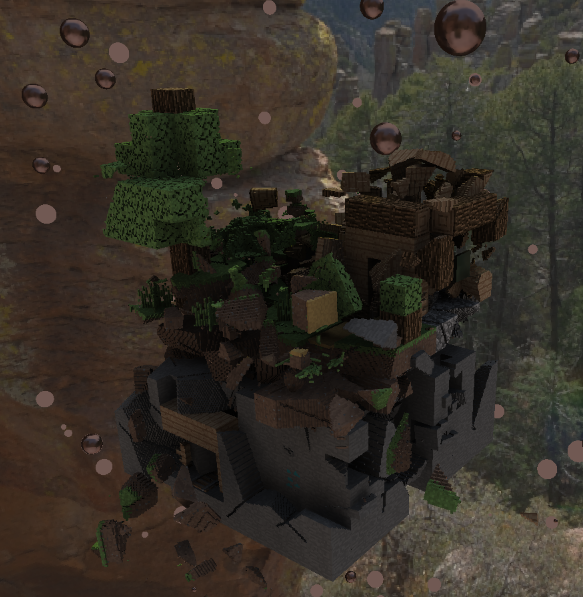

# Path tracing millions of voxels and have all voxel volumes colliding, in Teardown style.

Project made during my first year at BUAS. The code is not as beautiful as I would like but if you have any tips for nicer or more performative code they are always welcome. I already have a lot of things I will do differently next time.

# Building / Running
Extract the Assets.rar to be able to run the game. (the files are too big for github)
Project is made in visual studio 2022, run it in release with optimizations to get the best performance since physics and BVH-building is slow otherwise.

Voxel object fractures are made by generating Voronoi points in 3D and erasing the edges.
Then a flood-fill is run and objects are split appropriately.

There are many optimizations to be made, first off is turning small voxel volumes into particles and making them disappear after some time. 
Then sleeping voxel objects could easily be added for some great performance boosts unless there is a huge pile.
Then up next is a multi-threading the collision detection!

However I will be moving onto other projects, but might build upon this custom solver used here.

The voxel models are **NOT** mine, these have been collected from all over the internet. If you are the actual owner and want me to remove them I will do so immediately.

[youtube video](https://www.youtube.com/watch?v=k4c949nH2sY)
[linkedin post](https://www.linkedin.com/feed/update/urn:li:activity:7445191257531879426/?originTrackingId=lykDB1n90c6eZOPvVvxfBg%3D%3D)

